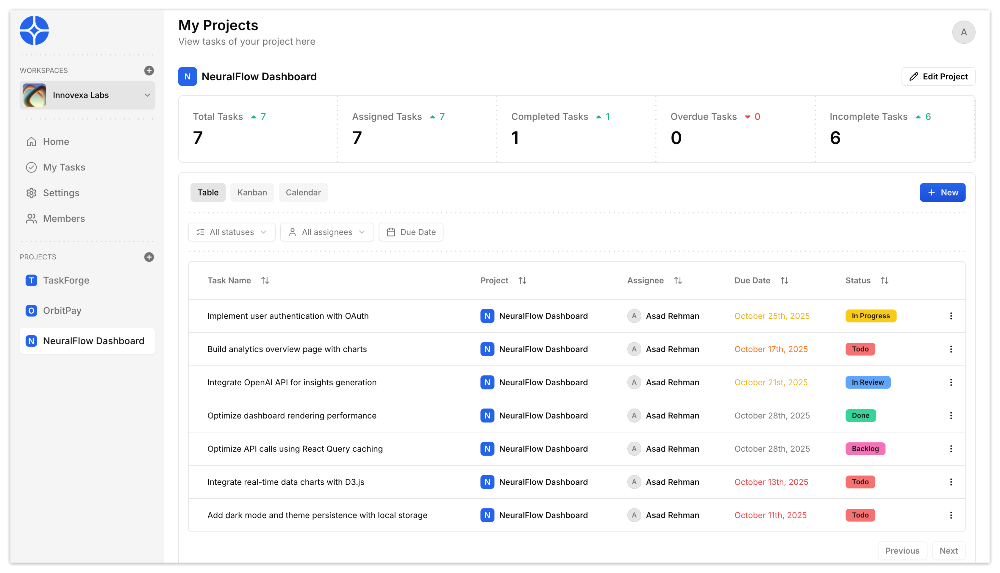

# 🧠 Workboard

**Collaborate, Organize, and Execute in one place.**  
Workboard is a powerful project management platform inspired by Jira, built with Next.js, Appwrite, Hono.js RPC, Tailwind CSS and Shadcn UI.
Manage your workspaces, projects, and tasks, visualize progress in Kanban, Calendar, or Table views, and collaborate with your team in real-time.

---

## 🚀 Features

- **🏢 Create and manage multiple workspaces**
- **📊 Organize work with projects and epics**
- **✅ Assign and track tasks effortlessly**
- **📋 Kanban board with drag-and-drop functionality**
- **🗃️ Table view for structured task management**
- **📅 Calendar view for scheduling and deadlines**
- **✉️ Invite members via secure invite links**
- **⚙️ Manage workspace and project settings**
- **🖼️ Upload avatars and attachments**
- **🔌 Appwrite SDK integration for database, storage, and authentication**
- **⚛️ Next.js 14 with server actions**
- **🎨 Shadcn UI + TailwindCSS for modern, elegant design**
- **🔍 Advanced search and filtering**
- **📈 Analytics dashboard to visualize performance**
- **👥 Role-based permissions (Admin / Member)**
- **🔒 Authentication via OAuth (GitHub) and Email**
- **📱 Fully responsive for all devices**
- **🚀 Lightweight API powered by Hono.js with RPC Integration**

---

## 🛠 Tech Stack

- **Framework**: Next.js  
- **Backend & Database**: Appwrite
- **API**: Hono.js RPC Integration
- **UI Library**: Shadcn/UI + TailwindCSS       
- **State Management**: Tanstack/React Query + nuqs     
- **File Storage**: Appwrite Storage
- **Authentication**: OAuth (GitHub) + Email
- **Deployment**: Vercel

---

## 📝 Author

**Asad Rehman** — [GitHub](https://github.com/asadrehman1)  

---

## ⚡ License

MIT © 2025 Asad Rehman
